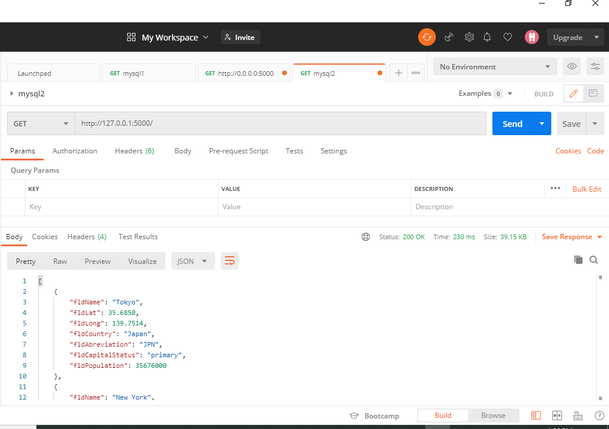
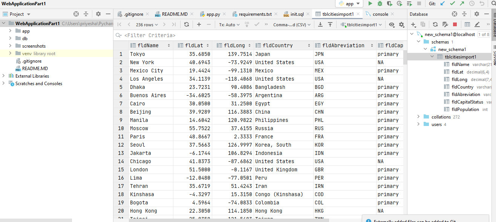

# Web application project part 1
# Project Description
## This project is non-docker based approved by professor
### This project is a homework assignment to teach how to get Pycharm setup with Docker, Flask, MySQL, and Postman

## Postman Screenshot

## SQL query screenshot

